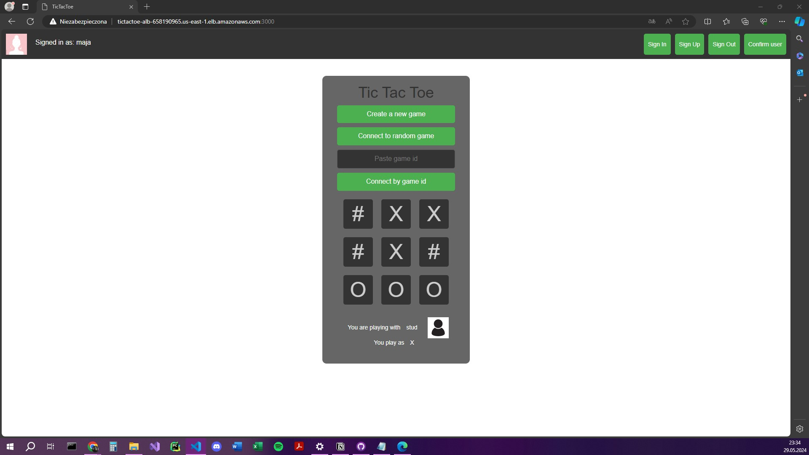
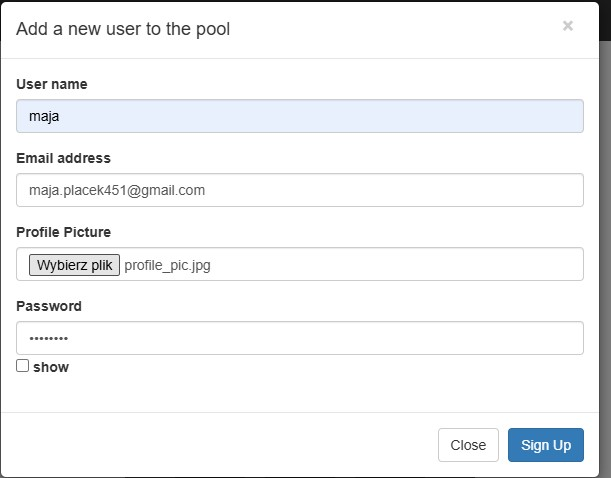

# Maja Placek - Terraform, EC2, TicTacToe report

- Course: Cloud programming
- Group: monday 9:15
- Date: 29.05.2024

# Environment architecture

## Overview

This architecture supports a TicTacToe application using various AWS services. It includes resources for user management, storage, networking, and deployment, all provisioned using Terraform.

## AWS Services Used

### Cognito
Cognito is used for user authentication and management. It handles user sign-up, sign-in, and access control.

### DynamoDB
DynamoDB is used to store game scores. It is a fully managed NoSQL database service that provides fast and predictable performance.

### VPC (Virtual Private Cloud)
A VPC is created to host all resources in a secure and isolated network environment. It includes subnets, route tables, and internet gateways.

### Subnets
Two public subnets are created within the VPC to host the application's resources, ensuring high availability across multiple availability zones.

### Internet Gateway
An internet gateway is attached to the VPC to enable internet access for resources within the VPC.

### Route Tables
Route tables are configured to manage routing within the VPC. They are associated with the subnets to define how traffic is directed.

### Security Groups
Security groups are used to control inbound and outbound traffic for the backend, frontend, and application load balancer (ALB).

### Application Load Balancer (ALB)
An ALB distributes incoming application traffic across multiple targets, such as backend and frontend services, to ensure high availability and reliability.

### ECS (Elastic Container Service)
ECS is used to run containerized applications. The architecture includes ECS clusters, task definitions, and services for both backend and frontend components.

### S3 (Simple Storage Service)
An S3 bucket is used to store profile pictures uploaded by users. It is a scalable object storage service that provides secure data storage and retrieval.

## Architecture Components

### Cognito User Pool
- **Resource**: Cognito User Pool
- **Purpose**: Manages user authentication and stores user data.
- **Attributes**: Includes password policies, user schema attributes (profile, address, birthdate, etc.), email verification settings, and MFA configuration.

### DynamoDB Table
- **Resource**: DynamoDB Table
- **Purpose**: Stores game scores.
- **Attributes**: Includes attributes such as GameId (Hash Key), Player1, Player2, and Winner.
- **Indexes**: Global secondary indexes on Player1 and Player2 to enable querying by player.

### VPC and Networking
- **VPC**: Provides an isolated network environment for resources.
- **Subnets**: Two public subnets in different availability zones for high availability.
- **Internet Gateway**: Enables internet access for resources within the VPC.
- **Route Tables**: Manage routing within the VPC, associated with the subnets.
- **Security Groups**: Control inbound and outbound traffic for backend, frontend, and ALB.

### Application Load Balancer
- **Resource**: ALB
- **Purpose**: Distributes traffic to backend and frontend services.
- **Listeners**: 
  - Backend service listener on port 8080.
  - Frontend service listener on port 3000.
- **Target Groups**: Health-checked target groups for backend and frontend services.

### ECS Cluster and Services
- **ECS Cluster**: Hosts containerized applications.
- **Task Definitions**: Define how backend and frontend containers are run.
- **ECS Services**: Ensure desired number of task instances are running and associated with the ALB.

### S3 Bucket
- **Resource**: S3 Bucket
- **Purpose**: Stores profile pictures.
- **Bucket Name**: `tic-tac-toe-pic-bucket`.

## Deployment and Configuration

### Terraform
Terraform is used to define and provision all resources. The configuration includes all necessary attributes and dependencies to ensure a fully functional and secure environment.

### Outputs
- **ALB Backend URL**: The URL for the backend service.
- **ALB Frontend URL**: The URL for the frontend service.
- **S3 Bucket Name**: The name of the S3 bucket for profile pictures.

# Preview

Screenshots of configured AWS services. Screenshots of your application running.

# Reflections

- What did you learn?
  - how to use s3 bucket and db in cloud apps for storing data
- What obstacles did you overcome?
  - Configuring global secondary indexes to allow querying game scores by players required a deep understanding of DynamoDB's indexing and querying capabilities.
- What did you help most in overcoming obstacles?
  - youtube tutorials:
    - https://www.youtube.com/watch?v=2q5jA813ZiI
    - https://www.youtube.com/watch?v=BJYDWMN8taI
- Was that something that surprised you?
  - configurations required for managing permissions
- Why DynamoDb?
    - The integration with AWS services and the availability of SDKs for various programming languages simplify the development process. Features like DynamoDB Streams allow easy implementation of event-driven architectures.
    - Being a NoSQL database, DynamoDB allows for a flexible schema design. This flexibility makes it easier to evolve the data model as the application requirements change, without the constraints of a fixed schema imposed by relational databases.
    - DynamoDB is fully managed, meaning that AWS handles all the operational aspects such as hardware provisioning, software patching, setup, configuration, and backups. This allows the development team to focus more on building the application rather than managing the database infrastructure.
